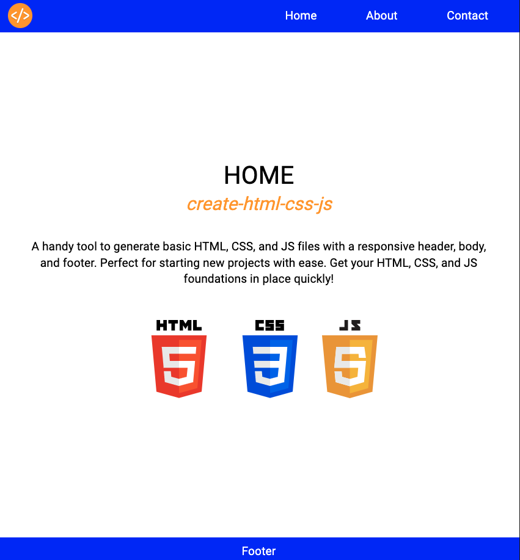

<h2 align="center">Hi 👋, I'm Victor Ottati</h2>
<h3 align="center">A passionate full stack website developer</h3>

**create-html-css-js:** A handy tool to generate basic HTML, CSS, and JS files with a responsive header, body, and footer. Perfect for starting new projects with ease. Get your HTML, CSS, and JS foundations in place quickly!

💾 Install > ` npm i create-html-css `

🖥  **npm** [: https://www.npmjs.com/package/create-html-css-js](https://www.npmjs.com/package/create-html-css-js)  

⚙️ All of my projects are available at [https://vmog.net/](https://vmog.net/)  

📫 How to reach me: **victor.ottati@gmail.com**  

💬 Ask me about: **REACT JS, NODE JS, HTML5, CSS3, Saas, Javascript & MongoDB**  

 

    
    
    

 

    

